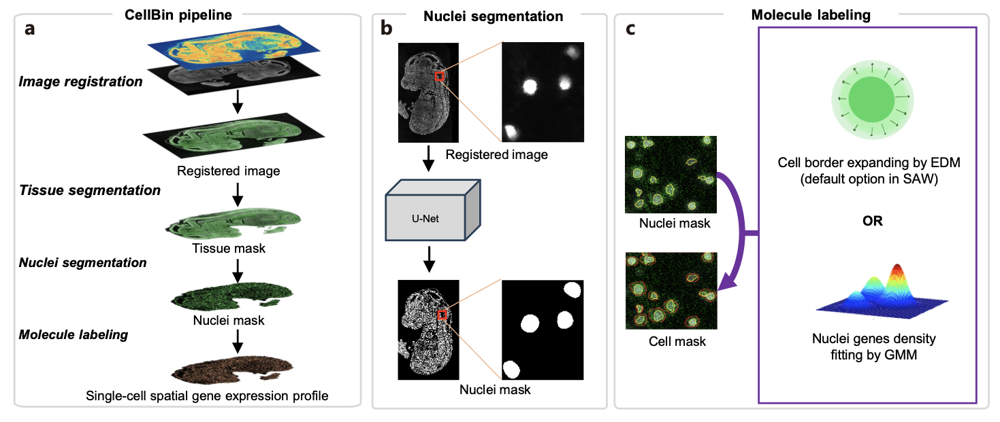

<div align="center">
  <br/>
  <h1 align="center">
    cellbin2: A framework for generating single-cell gene expression data
  </h1>
</div>

## Introduction
[CellBin introduction](docs/md/CellBin_1.0/CellBin解决方案技术说明.md) (Chinese) 

***Tweets*** <br>
[Stereo-seq CellBin introduction](https://mp.weixin.qq.com/s/PT3kPvsmrB3oQleEIMPkjQ)  (Chinese)  <br>
[Stereo-seq CellBin database introduction](https://mp.weixin.qq.com/s/OYJhAH6Bq1X1CQIYwugxkw) (Chinese)  <br>
[Stereo-seq CellBin cell segmentation intro](https://mp.weixin.qq.com/s/2-lE5OjPpjitLK_4Z0QI3Q) (Chinese)  <br>

***Paper related*** <br>
[CellBin: a highly accurate single-cell gene expression processing pipeline for high-resolution spatial transcriptomics](https://www.biorxiv.org/content/10.1101/2023.02.28.530414v5) [(GitHub Link)](https://github.com/STOmics) <br>
[CellBinDB: A Large-Scale Multimodal Annotated Dataset for Cell Segmentation with Benchmarking of Universal Models](https://www.biorxiv.org/content/10.1101/2024.11.20.619750v2) [(GitHub Link)](https://github.com/STOmics/cs-benchmark) <br>
[Generating single-cell gene expression profiles for high-resolution spatial transcriptomics based on cell boundary images](https://gigabytejournal.com/articles/110) [(GitHub Link)](https://github.com/STOmics/STCellbin) <br>

***Video tutorial*** <br>
[Cell segmentation tool selection and application](https://www.bilibili.com/video/BV1Ct421H7ST/?spm_id_from=333.337.search-card.all.click) (Chinese) <br>
[One-stop solution for spatial single-cell data acquisition](https://www.bilibili.com/video/BV1Me4y1T77T/?spm_id_from=333.337.search-card.all.click) (Chinese) <br>
[Single-cell processing framework for high resolution spatial omics](https://www.bilibili.com/video/BV1M14y1q7YR/?spm_id_from=333.788.recommend_more_video.12) (Chinese) 

## Installation
Linux
```shell
git clone https://github.com/STOmics/cellbin2
conda create --name cellbin2 python=3.8
cd cellbin2
python install.py 12  # if your cuda version is 12.x
python install.py 11  # if your cuda version is 11.x
python demo.py  # run 3 demos, approximately 30-40 mins on GPU
```


## Tutorials
```shell
KIT_VERSIONS = (
    'Stereo-seq T FF V1.2',
    'Stereo-seq T FF V1.3',
    'Stereo-CITE T FF V1.0',
    'Stereo-CITE T FF V1.1',
    'Stereo-seq N FFPE V1.0',
)
``` 
***Each product line has the configurations of the product and R&D versions. You can visit [config.md](docs/v2/config.md) to view the detailed configurations.***

### Official product
case 1: 
Stereo-seq T FF
DAPI + mIF
```shell
CUDA_VISIBLE_DEVICES=0 python cellbin2/cellbin_pipeline.py \
-c SS200000045_M5 \
-i /media/Data/dzh/data/cellbin2/demo_data/SS200000045_M5/SS200000045_M5_fov_stitched.tif \
-s DAPI \
-imf /media/Data/dzh/data/cellbin2/demo_data/SS200000045_M5/SS200000045_M5_ATP_IF_fov_stitched.tif,/media/Data/dzh/data/cellbin2/demo_data/SS200000045_M5/SS200000045_M5_CD31_IF_fov_stitched.tif,/media/Data/dzh/data/cellbin2/demo_data/SS200000045_M5/SS200000045_M5_NeuN_IF_fov_stitched.tif \
-m /media/Data/dzh/data/cellbin2/demo_data/SS200000045_M5/SS200000045_M5.raw.gef \
-o /media/Data/dzh/data/cellbin2/test/SS200000045_M5_11 \
-k "Stereo-seq T FF V1.2"
```
case 2: 
Stereo-seq T FF
ssDNA
```shell
CUDA_VISIBLE_DEVICES=0 python cellbin2/cellbin_pipeline.py \
-c SS200000135TL_D1 \
-i /media/Data/dzh/data/cellbin2/demo_data/product_demo/SS200000135TL_D1/SS200000135TL_D1.tif \
-s ssDNA \
-m /media/Data/dzh/data/cellbin2/demo_data/product_demo/SS200000135TL_D1/SS200000135TL_D1.raw.gef \
-o /media/Data/dzh/data/cellbin2/test/SS200000135TL_D1 \
-k "Stereo-seq T FF V1.2"
```
case 3: 
Stereo-seq T FF
H&E
```shell
CUDA_VISIBLE_DEVICES=0 python cellbin2/cellbin_pipeline.py \
-c C04042E3 \
-i /media/Data/dzh/data/cellbin2/demo_data/product_demo/C04042E3/C04042E3.tif \
-s HE \
-m /media/Data/dzh/data/cellbin2/demo_data/product_demo/C04042E3/C04042E3.raw.gef \
-o /media/Data/dzh/data/cellbin2/test/C04042E3 \
-k "Stereo-seq T FF V1.2"
```

### Research mode
case 1:
Stereo-CITE 
DAPI + IF + trans gef
```shell
CUDA_VISIBLE_DEVICES=0 python cellbin2/cellbin_pipeline.py \
-c A02677B5 \
-i /media/Data/dzh/data/cellbin2/demo_data/product_demo/A02677B5/A02677B5.tif \
-s DAPI \
-imf /media/Data/dzh/data/cellbin2/demo_data/product_demo/A02677B5/A02677B5_IF.tif \
-m /media/Data/dzh/data/cellbin2/demo_data/product_demo/A02677B5/A02677B5.raw.gef \
-o /media/Data/dzh/data/cellbin2/test/A02677B5 \
-k "Stereo-CITE T FF V1.1 R"
```

case 2: 
Stereo-CITE
DAPI + protein gef
```shell
CUDA_VISIBLE_DEVICES=0 python cellbin2/cellbin_pipeline.py \
-c A03899A4 \
-i /media/Data/dzh/data/cellbin2/data/A03899A4/A03899A4_fov_stitched.tif \
-s DAPI \
-pr /media/Data/dzh/data/cellbin2/data/A03899A4/A03899A4.protein.tissue.gef \
-o /media/Data/dzh/data/cellbin2/test/A03899A4 \
-k "Stereo-CITE T FF V1.1 R"
```

case 3:
Stereo-CITE
DAPI + IF + trans gef + protein gef
```shell
CUDA_VISIBLE_DEVICES=0 python cellbin2/cellbin_pipeline.py \
-c A03599D1 \ # chip number
-i /media/Data/A03599D1_DAPI_fov_stitched.tif \  # ssDNA, DAPI, HE data path
-imf /media/Data/A03599D1_IF_fov_stitched.tif \  # IF data path
-s DAPI \  # stain type，(ssDNA, DAPI, HE)
-m /media/Data/A03599D1.raw.gef \  # Transcriptomics gef path
-pr /media/Data/A03599D1.protein.raw.gef \  # protein gef path
-o /media/Data/C04042E3_demo \ # output dir
-k "Stereo-CITE T FF V1.1 R"
```

more examples, please visit [example.md](docs/v2/example.md)

## ErrorCode
refer to [error.md](docs/v2/error.md)


## Outputs

| File Name | Description |
| ---- | ---- |
| A03599D1_cell_mask.tif | Final cell mask |
| A03599D1_mask.tif | Final nuclear mask |
| A03599D1_tissue_mask.tif | Final tissue mask |
| A03599D1_params.json | CellBin 2.0 input params |
| A03599D1.ipr | Image processing record |
| metrics.json | CellBin 2.0 Metrics |
| CellBin_0.0.1_report.html | CellBin 2.0 report |
| A03599D1.rpi | Recorded image processing (for visualization) |
| A03599D1_DAPI_mask.tif | Cell mask on registered image |
| A03599D1_DAPI_regist.tif | Registered image |
| A03599D1_DAPI_tissue_cut.tif | Tissue mask on registered image |
| A03599D1_IF_mask.tif | Cell mask on registered image |
| A03599D1_IF_regist.tif | Registered image |
| A03599D1_IF_tissue_cut.tif | Tissue mask on registered image |


## Other content


## Reference
https://github.com/STOmics/CellBin <br>
https://github.com/MouseLand/cellpose <br>
https://github.com/matejak/imreg_dft <br>
https://github.com/rezazad68/BCDU-Net <br>
https://github.com/libvips/pyvips <br>
https://github.com/vanvalenlab/deepcell-tf <br>
https://github.com/ultralytics/ultralytics <br>
