# QuPath中做细胞分割操作文档

- [QuPath中做细胞分割操作文档](#qupath中做细胞分割操作文档)
- [背景介绍](#背景介绍)
- [目的](#目的)
- [使用范围](#使用范围)
- [工具与脚本介绍](#工具与脚本介绍)
- [操作步骤](#操作步骤)
  - [自动分割](#自动分割)
    - [1. 荧光染色：以ssDNA为例](#1-荧光染色以ssdna为例)
    - [2. H\&E染色](#2-he染色)
  - [批量删除不需要的细胞分割mask](#批量删除不需要的细胞分割mask)
    - [1. 荧光染色：以ssDNA为例修改mask](#1-荧光染色以ssdna为例修改mask)
    - [2. H\&E染色修改mask](#2-he染色修改mask)
  - [手动分割](#手动分割)
    - [1. 荧光染色：以ssDNA为例](#1-荧光染色以ssdna为例-1)
    - [2. H\&E染色](#2-he染色-1)

# 背景介绍

细胞分割是指将显微镜图像中的细胞边界准确地分割出来的过程。这是生物医学图像处理和计算机视觉领域中非常重要的任务，因为细胞分割可以用于研究细胞形态、数量和分布，以及对疾病诊断、药物筛选和基础研究等方面具有广泛的应用。
在显微镜图像中，细胞的形状、大小和颜色等特征存在显著差异，这会给细胞分割带来挑战。为了实现准确的细胞分割，可以使用图像处理技术，如阈值分割、边缘检测和区域生长等。这些方法通过对图像进行预处理和特征提取，然后使用特定的算法来分割细胞。
若当前算法无法胜任复杂的细胞分割任务，本手册提供细胞分割工具Qupath的使用方法，通过手动方式解决细胞分割。

# 目的

使用QuPath工具完整准确地分割出细胞形状，修正或是生成细胞分割结果。

# 使用范围

目前适用于ssDNA、HE染色的细胞分割，本手册将以分别以ssDNA和HE染色图举例

# 工具与脚本介绍

|      工具名称       | 使用版本  |                           工具说明                           |                           下载地址                           |
| :-----------------: |:-----:| :----------------------------------------------------------: | :----------------------------------------------------------: |
|       QuPath        | 0.5.1 |                          Qupath软件                          | [Release v0.5.1 · qupath/qupath · GitHub](https://github.com/qupath/qupath/releases/tag/v0.5.1) |
| mask2geojson.py脚本 |   \   | 将原有的细胞分割二值化图像转换成适配Qupath软件的geojson的脚本工具 | [mask2geojson.py](https://github.com/STOmics/CellBin-R/blob/main/tutorials/mask2geojson.py) |
|       ImageJ        |   \   |                     看图以及编辑图像软件                     |             https://imagej.net/ij/download.html              |

# 操作步骤

## 自动分割

### 1. 荧光染色：以ssDNA为例

* #### <li id='1'>**step1**</li>
    **将图片拖入QuPath中，选择Fluorescence，点击Apply**

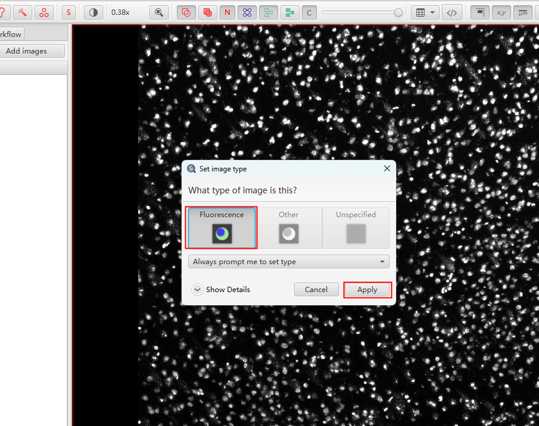

* #### **step2**
    **使用矩阵框将图片全部框出（也可以局部框选需要部分）**

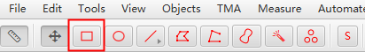

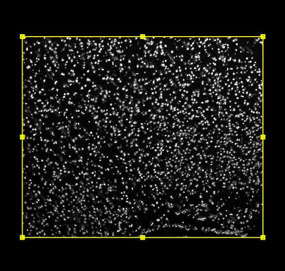

* #### **step3**
    **点击Analyze>Cell detection>cell detection调整参数**

  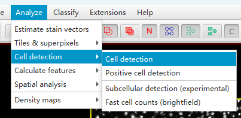

* #### **step4**
    **调整合适的参数，使得细胞分割满足要求**

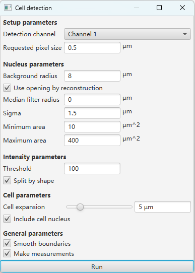

（1）Requested pixel size：请求的像素大小。将其调大，每个像素代表的实际物理面积变大，图像的细节看起来更模糊，相当于以较低的分辨率查看图像。调小则每个像素代表的实际物理面积变小，图像的细节会更加清晰，相当于以较高的分辨率查看图像。

（2）Background radius：背景半径。在细胞较大或者密集堆积的情况下调大，设置过大会导致错误地将背景噪声识别为细胞的一部分 。在细胞较小或者背景噪声较高的情况下调小，设置过小将无法准确捕捉到细胞周围的背景变化。

（3）Median filter radius：中值滤波半径，调大会增加滤波的半径，更有效地平滑图像。如果设置过大，可能会导致图像的细节丢失，细胞边缘可能会变得模糊。调小会减少滤波的邻域范围，图像的细节保留得更多。如果半径太小，可能不足以去除图像中的噪声。

（4）Sigma：针对细胞核的调整，数值越低，细胞被分的越碎。

（5）Minimum area：在细胞检测过程中将保留的最小细胞或组织区域的大小。如果检测到的区域小于这个设定值，那么这些区域将被忽略或丢弃。值增加会使得更大的细胞或组织区域被检测和分析。

（6）Maximum area：在细胞检测过程中将被自动填充的最大“空洞”或间隙的面积。如果一个区域内的空洞大于这个设定值，那么这个空洞将不会被自动填充，而是保留为一个单独的区域。值减小可以使得更小的空洞被填充。

（7）Threshold：判断为细胞核的阈值，数值越小，分割出越多的细胞。

（8）Cell expansion：细胞扩充，数值越小越贴合细胞。

效果如下：

* #### **step5**
    **删除矩阵框**

  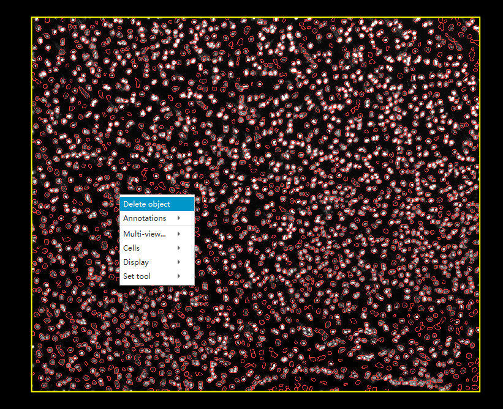

* #### <li id='6'>**step6**</li>
    **将图片发送到ImageJ**

* #### **step7**
    **取消第一项，点击OK**

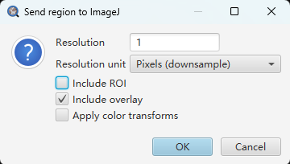

* #### **step8**
    **点击Edit>Selection>Create Mask生成mask图**

  

* #### **step9（optional）**
    **设置分水岭**

若细胞之间挨得紧密，会出现细胞之间没有完全分开

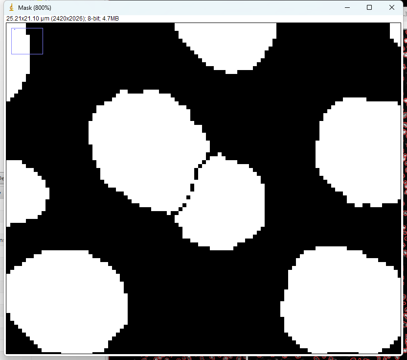

点击Process>Binary>Watershed

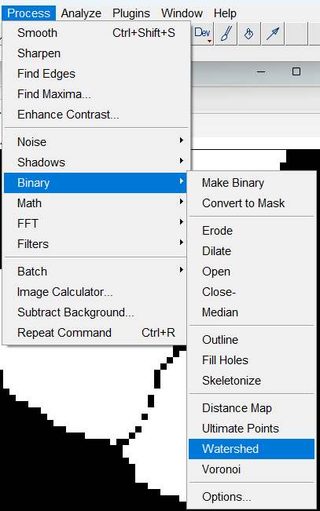

细胞就会分开

* #### **step10**
    **点击File>Save As>Tiff将mask保存为tiff格式**

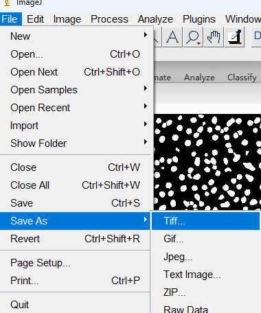

### 2. H&E染色

2.1 [与上述方法相同。](#1)第一步导入图片时选择H&E染色，点击Apply

2.2 H&E自动分割参数示例：

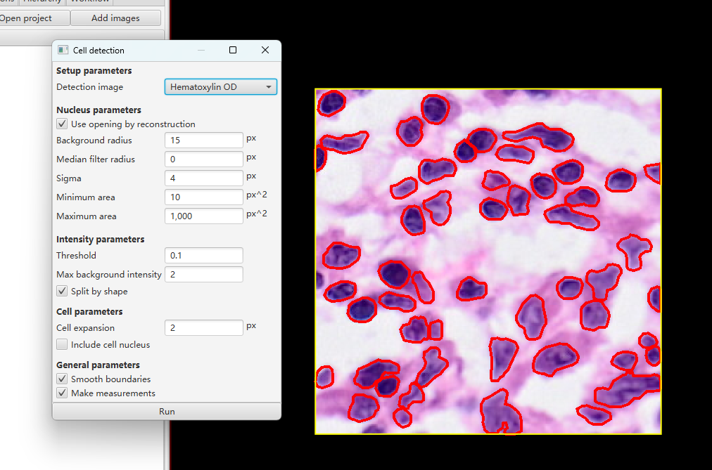

## 批量删除不需要的细胞分割mask

### 1. 荧光染色：以ssDNA为例修改mask

该方法用于只修改局部不满意的细胞分割结果，需要用到ImageJ。操作如下：

* #### **<li id='2'>step1</li>**
  **将mask图与原图拖进ImageJ中，选中一张图片，点击Image>Type，确保两张图片的位深一致**

				

* #### **step2**
  **点击Color>Merge Channels，将mask图与原图merge在一起**

		

* #### **step3**
  **将mask图与原图选择合适的颜色，建议mask图选红色，原图选灰色。选择Keep source images会保留来源图片，点击OK，观察需要删除的区域**

			

* #### **step4**
  **使用合适工具框出需要删除的部位，按键盘Delete进行删除**

  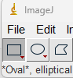

  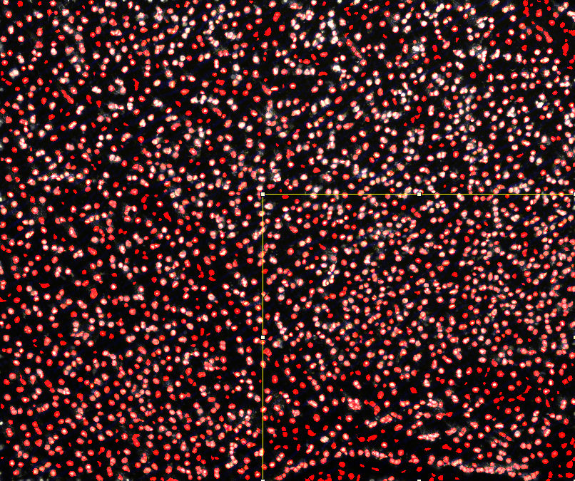

  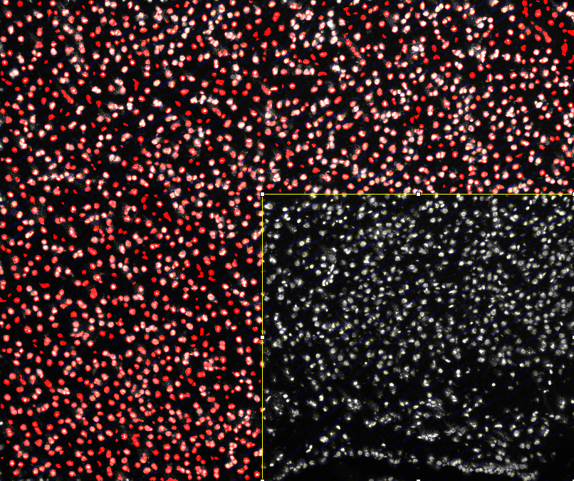

* #### **step5**
  **操作完成后，点击Image>Color>Split Channels将merge图分离**
  
  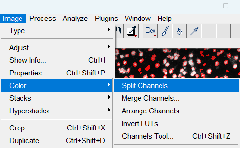

* #### **step6**
  **将该图转回8bit图像并保存**
  
  

* #### **step7(optional)**
  **将保存后的mask图进一步修改**

  该方法用于将修改后的细胞分割结果转成geojson，并在QuPath中补上新增的细胞分割。使用上述 **“工具与脚本介绍”** 中提到 mask2geojson.py，修改脚本中的路径。
生成geojson后，打开Qupath，依次将图像、geojson拖入画框中，按照上述[自动分割](#自动分割)的方法，使用Qupath补上新增的细胞分割最终生成符合预期的细胞分割mask图像。

### 2. H&E染色修改mask
[操作同ssDNA](#2)

## 手动分割

### 1. 荧光染色：以ssDNA为例

* #### **<li id='3'>step1</li>**
  **将图片导入到QuPath中，选择Fluorescence，点击Apply**

* #### **step2**
  **使用合适工具进行分割**

（1）使用笔刷工具

[视频链接](../../images/QuPath_cellbin_SOP/brushes.mp4)

按住鼠标左键扩大mask范围

按住alt再按鼠标左键，可从mask外部缩小范围

（2）使用多边形工具

[视频链接](../../images/QuPath_cellbin_SOP/polygon.mp4)

鼠标左键点击生成节点，连接到最后一个节点双击即可完成框选

（3）对于多分，选定后按鼠标右键选删除

（4）移动节点修改mask

双击选定

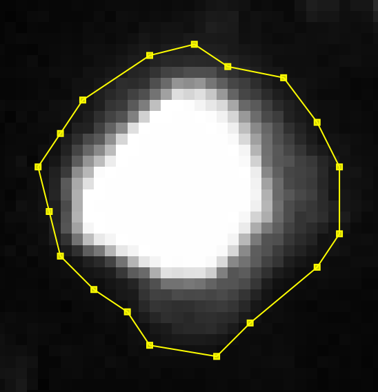

拖动节点修改mask

[视频链接](../../images/QuPath_cellbin_SOP/grag_node.mp4)

* #### 分割完成后接回[自动分割中的step6](#6)

### 2. H&E染色

[操作与ssDNA相同](#3)