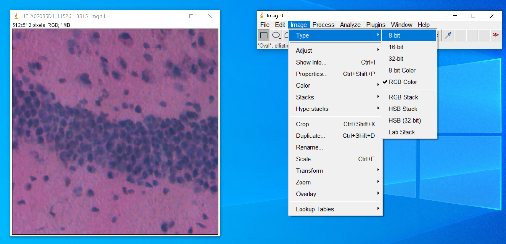
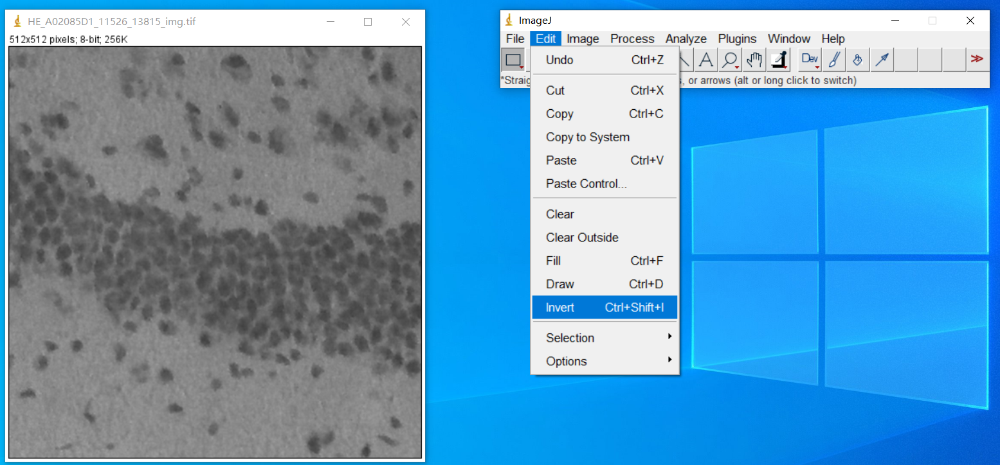
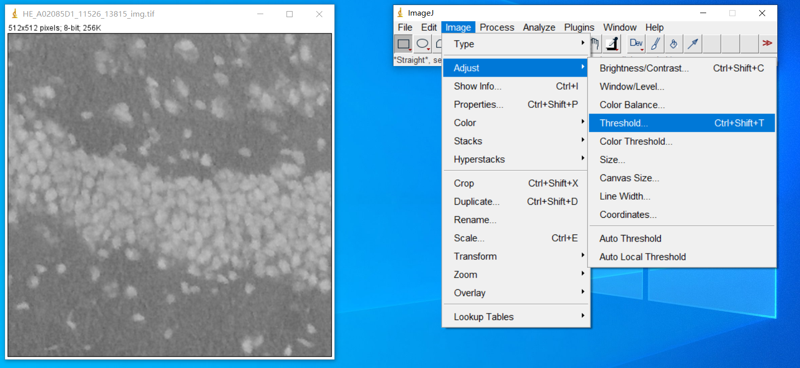
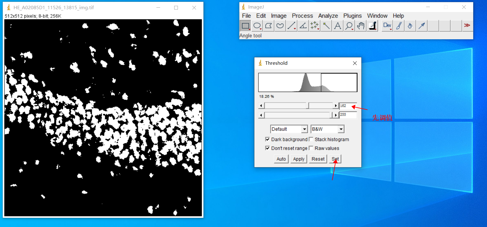
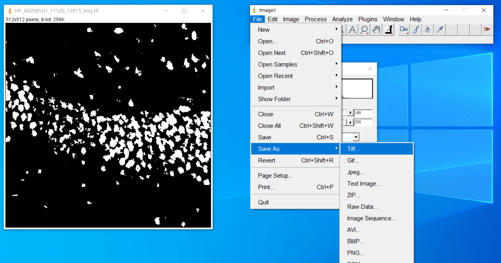
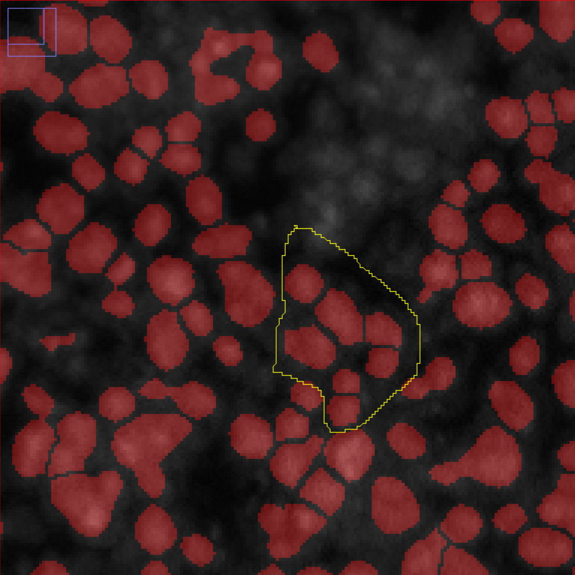
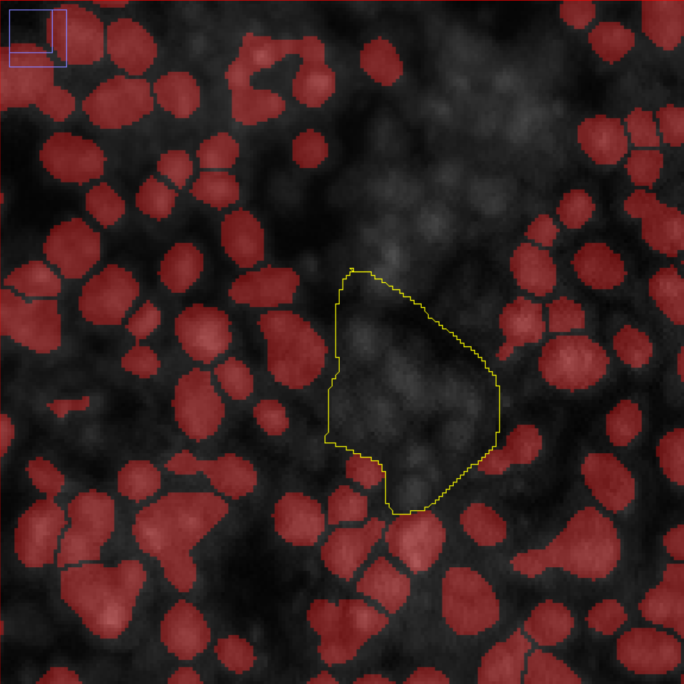
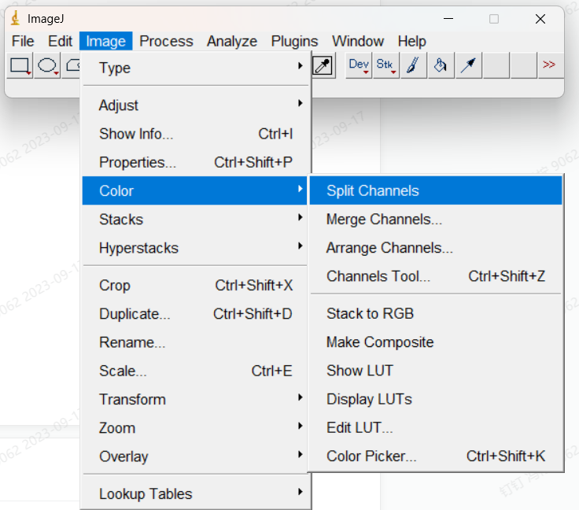
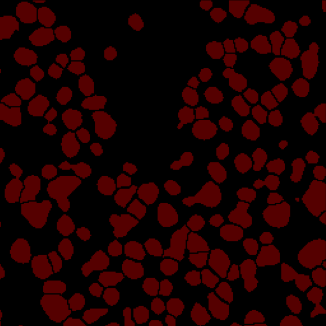

# 细胞分割解决方案（ssDNA,DAPI,H&E）——Qupath操作说明书

- [细胞分割解决方案（ssDNA,DAPI,H\&E）——Qupath操作说明书](#细胞分割解决方案ssdnadapihequpath操作说明书)
  - [SOP的用途](#sop的用途)
    - [背景介绍：](#背景介绍)
    - [目的：](#目的)
    - [使用范围：](#使用范围)
  - [工具与脚本介绍](#工具与脚本介绍)
  - [操作步骤](#操作步骤)
    - [Qupath基础操作](#qupath基础操作)
    - [不同染色的处理方式：](#不同染色的处理方式)
      - [-- ssDNA/DAPI](#---ssdnadapi)
      - [-- H\&E](#---he)
    - [批量删除不需要的细胞分割mask：](#批量删除不需要的细胞分割mask)
    - [将细胞mask转成可放入Qupath的geojson：](#将细胞mask转成可放入qupath的geojson)

## SOP的用途
### 背景介绍：
细胞分割是指将显微镜图像中的细胞边界准确地分割出来的过程。这是生物医学图像处理和计算机视觉领域中非常重要的任务，因为细胞分割可以用于研究细胞形态、数量和分布，以及对疾病诊断、药物筛选和基础研究等方面具有广泛的应用。<br>
在显微镜图像中，细胞的形状、大小和颜色等特征存在显著差异，这会给细胞分割带来挑战。为了实现准确的细胞分割，可以使用图像处理技术，如阈值分割、边缘检测和区域生长等。这些方法通过对图像进行预处理和特征提取，然后使用特定的算法来分割细胞。<br>
若当前算法无法胜任复杂的细胞分割任务，本手册提供细胞分割工具Qupath的使用方法，通过手动方式解决细胞分割。<br>
### 目的：
使用QuPath工具完整准确地分割出细胞形状,修正或是生成细胞分割结果。 <br>

### 使用范围：
目前适用于ssDNA、DAPI、HE染色的细胞分割，本手册将以分别以ssDNA和HE染色图举例 <br>

## 工具与脚本介绍
| 工具名称            | 使用版本  | 工具说明                                    | 下载地址     | 
|-----------------|-------|-----------------------------------------|----------|
| QuPath          | 0.4.3 | Qupath软件                                | https://github.com/qupath/qupath/releases/tag/v0.4.3 |
| mask2geojson.py脚本 | \     | 将原有的细胞分割二值化图像转换成适配Qupath软件的geojson的脚本工具 | [mask2geojson.py](/tutorials/mask2geojson.py)|
| ImageJ          | \     | 看图以及编辑图像软件，可以对三通道图像进行转灰和反色，对删除部分细胞分割结果。 |https://imagej.net/ij/download.html    |

## 操作步骤
### Qupath基础操作
可阅读该SOP:<br>
[Qupath部分操作SOP](2.Qupath部分操作SOP.md)

### 不同染色的处理方式：

#### -- ssDNA/DAPI
可直接放进qupath里操作。<br>
针对较密集的细胞，可以将minimum area、sigma，Background radius调小。<br>
针对较暗的细胞，可是适当将Threshold调小。或者给背景增量。<br>
针对稀疏的细胞，可以将cell expansion适当调大。<br>
（以上三种方式对于任何染色都可以尝试参考）<br>


#### -- H&E
**如果是H&E图像需对图像转成8位灰度图，且进行反色，再放入Qupath中。<br>**

**-- 如果图像小于2G，可以直接放入ImageJ在进行反色操作，操作如下：<br>**
a. 将图像拖入ImageJ<br>

b.image>Type>8-bit<br>


c.将图片进行反色<br>


d.image>Adusj>Threshold,数值越大分离越明显<br>


调完值点击set，然后file -save as -tiff<br>




**--如果图像大于2G，无法直接放入ImageJ在进行反色操作，需要使用脚本将HE图像转成8bit灰度图像并反色，以下提供一种方法：<br>**
```shell
pip install cell-bin
```

```python
import tifffile
from cellbin.image.augmentation import f_rgb2gray
from cellbin.image.augmentation import f_ij_16_to_8

img = "Path/to/img.tif"
img = tifffile.imread(input)
img = f_rgb2gray(img)
img = f_ij_16_to_8(img)
img = 255 - img
tifffile.imwrite("Path/to/save/new.tif", img)
```
若有需求，可将存好的图像放入ImageJ执行上诉”d.image>Adusj>Threshold“ 步骤。<br>


### 批量删除不需要的细胞分割mask：
该方法用于只修改局部不满意的细胞分割结果，需要用到ImageJ。操作如下:<br>

1、首先先将mask图与原图merge在一起。观察需要删除的区域。<br>
2、圈中要删除的部位，点击Backspace<br>
<center class="half">


</center>

3、操作完成后，将该merge图分离<br>
<center class="half">


</center>

4、将该图转回8bit图像。

### 将细胞mask转成可放入Qupath的geojson：
该方法用于将修好后的的细胞分割结果转成geojson。使用上述 **“工具与脚本介绍”** 中提到 mask2geojson.py，修改脚本中的路径。<br>
生成geojson后，打开Qupath，依次将图像、geojson拖入画框中，按照上述 **“Qupath基础操作”** 的SOP的生成细胞分割结果的方法，使用Qupath补上新增的细胞分割最终生成符合预期的细胞分割mask图像。
