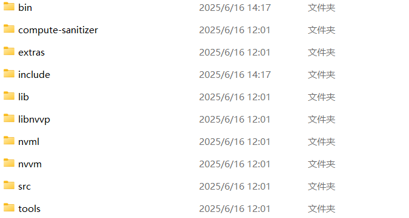

# Using the GPU READNE_EN

If you wish to use the GPU or have problems with the GPU during use, troubleshoot the cause by running ``tutorials/test_gpu.py``.

If it appears that **test_gpu.py**  runs with normal results, but no CUDA version is too old to use the GPU on the mIF data. Please check the method directly at the end of the article.
```bash
# Enter the environment to be tested
conda activate env_name
# Run the GPU test code
python tutorials/test_gpu.py --gpu <Select the GPU number to be tested>
```
Execute the code When the following example appears, the run was successful! You will be able to start using the GPU for accelerated inference.
```bash
Starting to check maximum supported CUDA version, actual CUDA version and ONNXRuntime-gpu version...
**Maximum CUDA version supported by GPU (nvidia-smi): | NVIDIA-SMI 535.183.01             Driver Version: 535.183.01   CUDA Version: 12.2     |
**Actual installed CUDA version: Cuda compilation tools, release 12.1, V12.1.105
**onnxruntime-gpu version: Version: 1.16.1Required-by:
Note: The actual installed CUDA version should not be higher than the maximum supported CUDA version!
✅ GPU is theoretically supported, starting actual verification...
🎉 Successfully running in GPU mode

Detailed diagnostic information:
              status: gpu_ok
         gpu_support: True
     active_provider: CUDAExecutionProvider
```
If the above words do not appear
Please follow the prompts to troubleshoot the cause step by step, after the troubleshooting is completed, please run **test_gpu.py** again to see if it has been resolved.
Apart from GPU out of memory, the rest of the reasons centered on **hardware driver and version matching**.

##  1.Hardware and driver related

Ensure NVIDIA graphics card is present and working properly, need correct **CUDA and cuDNN**

If  
```bash
**Maximum CUDA version supported by GPU (nvidia-smi):
**Actual installed CUDA version:
None of the information is exported
```
It is possible that the NVIDIA graphics card is not installed or that there is a problem with the graphics card driver (in the FIRST case, you need to install a suitable inference graphics card, in the SECOND case, please refer to [NVIDIA GeForce Drivers](https://www.nvidia.cn/geforce/drivers/))

If  
```bash
**Maximum CUDA version supported by GPU (nvidia-smi):Having output
**Actual installed CUDA version:No output
```
It is possible that CUDA was not installed successfully (Check [CUDA Toolkit](https://developer.nvidia.com/cuda-toolkit))

Note that the actual installed version of CUDA cannot be higher than the highest supported version.

You can check your **cuDNN version** by the following methods (Linux and Windows methods are different)
```bash
# Checking the installed version of the cuDNN（linux）
find /usr -name "*cudnn*" -type f | grep -i libcudnn.so

# Checking the installed version of the cuDNN（windows）
# Open the CUDA installation directory (usually is C:\Program Files\NVIDIA GPU Computing Toolkit\CUDA\vX.X\include）
# Look for the file cudnn.h or cudnn_version.h
# Open it with a text editor and look for CUDNN_MAJOR, CUDNN_MINOR and CUDNN_PATCHLEVEL
```
If no cuDNN is available, it is necessary to start with a cuDNN according to the [ONNXRuntime official website](https://onnxruntime.ai/docs/execution-providers/CUDA-ExecutionProvider.html) Check for matches and find the desired version to download

Attention:

If there are multiple CUDA environments on the system, do not use the .exe file to install cuDNN, as it may cause errors by confusing the CUDA environments that need to be installed，You can choose the right version to download after selecting your system in [CUDA and cuDNN](https://developer.download.nvidia.cn/compute/cudnn/redist/cudnn/)

After downloading the archive file perform the following installation steps:
1. Unzip the archive file
2. Drag the files in the unzipped archive file into the folder with the corresponding name of the CUDA environment you want to install.

eg：


(This is the unzipped folder of cuDNN)



(This is the folder in the corresponding version of CUDA)

## 2.Package installation related to version conflicts
You need to make sure you have ``onnxruntime-gpu`` installed first (note that the packages ``onnxruntime-gpu`` and ``onnxruntime`` are not equivalent)
```bash
**onnxruntime-gpu version: Version: 1.16.1Required-by:
```
The output of this line includes the currently installed version of onnxruntime-gpu and the package dependencies present (it is normal for package dependencies to be empty sometimes)

You need to check for version matching against the output.

The ones to check include CUDA, cuDNN, and ``onnxruntime-gpu`` to see if they match (if you haven't installed any one or more of them yet, you should also install them according to the following method to find a matching version)

CUDA version via ``Actual installed CUDA version:`` output 

onnxruntime version via ``onnxruntime-gpu version: Version: 1.16.1Required-by:`` output 

cuDNN needs to be viewed by yourself (1. Hardware and driver related). 

After getting the version information between the three check whether it matches according to the [ONNXRuntime official website](https://onnxruntime.ai/docs/execution-providers/CUDA-ExecutionProvider.html).

If there is a mismatch it is recommended to prioritize the replacement of ``onnxruntime-gpu`` version and choose the version of ``onnxruntime-gpu`` that matches the current version of CUDA and cuDNN.

You need to uninstall the mismatched version of ``onnxruntime-gpu`` first.
```bash
## If**onnxruntime-gpu version: Version: x.x.x Required-by:xxx is Required-by include cell-bin
#uninstall cell-bin onnxruntime onnxruntime-gpu
pip uninstall cell-bin onnxruntime onnxruntime-gpu -y
# Install a suitable version
pip install onnxruntime-gpu==x.x.x
# Check the installed version is expected
pip show  onnxruntime-gpu 
#reinstallation cell-bin
pip install --no-deps cellbin


## If**onnxruntime-gpu version: Version: x.x.x Required-by:xxx 中 Required-by not include cell-bin
#uninstall onnxruntime onnxruntime-gpu
pip uninstall onnxruntime onnxruntime-gpu -y
# Install a suitable version
pip install onnxruntime-gpu==x.x.x
#Check the installed version is expected
pip show onnxruntime-gpu 
```
### Other steps GPU calls work fine, mIF has problems using cellpose


The main reason for the above is the mismatch between PyTorch version and CUDA version.  

If you run **test_gpu.py** without error. You can use the following method to try to solve the problem 

View CUDA, PyTorch version
```bash
# View the current CUDA version：
nvcc --version
# View the current PyTorch version：
pip show torch
```
For example: current PyTorch version: 2.4.1, prompts requires: cuda-cu12  
PyTorch and current cuda version conflict. This is due to the fact that the highest version of PyTorch is installed by default in the cellpose environment.


If this is the case, you can first check the appropriate current version of ``PyTorch`` for CUDA by following the link  

[Get Started](https://pytorch.org/get-started/locally/)  

[Previous PyTorch Versions](https://pytorch.org/get-started/previous-versions/)  

Subsequently reinstall that version of`` PyTorch`` and subsequently ``cellpose`` works fine with GPUs

```bash
# Uninstall the original PyTorch
pip uninstall torch torchvision torchaudio -y
# Install the matching version of PyTorch, for example：
pip install torch==1.13.1+cu117 torchvision==0.14.1+cu117 torchaudio==0.13.1 --extra-index-url https://download.pytorch.org/whl/cu117

# Validate， into python interaction page
import torch
print(torch.__version__)          # outputs 1.13.1+cu117
print(torch.cuda.is_available())  # outputs True
print(torch.version.cuda)         # outputs 11.7
```

